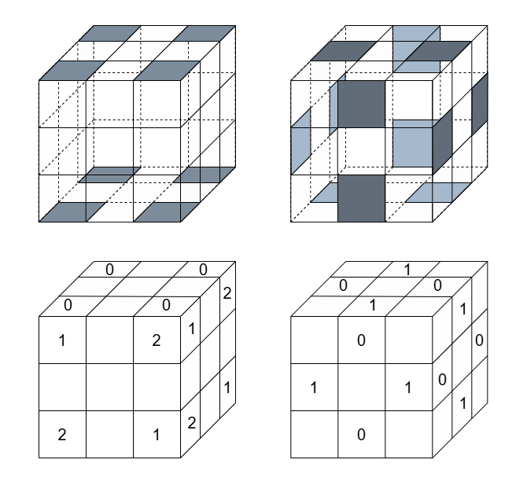

# Modelos

Una vez introducida la teoría de grupos, podemos aplicarla al estudio del cubo de Rubik como sistema algebraico. 

Para ello, debemos empezar hablando de sus **posibles movimientos**. Estos se pueden categorizar en tres tipos:
- Los movimientos de cara: son aquellos en los que se gira 90º o 180º una de las caras. 
- Los movimientos de capa intermedia: son aquellos en los que se gira 90º o 180º una capa intermedia. 
- Los movimientos de cubo: son aquellos en los que se gira 90º o 180º todo el cubo alrededor de uno de sus tres ejes principales..

En total hay 18 movimientos de cara, 9 movimientos de capa intermedia y 9 movimientos de cubo.

Los movimientos sobre la misma cara, la misma capa intermedia o el mismo eje del cubo siguen la siguiente notación: 
- $R$: giro de 90º en sentido horario
- $R'$: giro de 90º en sentido antihorario
- $R^2$: giro de 180º

Teniendo esto en cuenta, cualquier secuencia de estos movimientos se puede combinar o cancelar, siguiendo esta tabla donde el estado inicial es $I$, las filas son el primer movimiento que se realiza y las columnas son el segundo movimiento que se realiza:
|        | $I$   | $R$   | $R'$  | $R^2$ |
|:------:|:-----:|:-----:|:-----:|:-----:|
| $I$    | $I$   | $R$   | $R'$  | $R^2$ |
| $R$    | $R$   | $R^2$ | $I$   | $R'$  |
| $R'$   | $R'$  | $I$   | $R^2$ | $R$   |
| $R^2$  | $R^2$ | $R'$  | $R$   | $I$   |

Se considera **algoritmo** sobre el cubo a la secuencia finita de movimientos en la que no hay dos movimientos de la misma cara o misma capa intermedia seguidos, ni dos movimientos de cubo alrededor del mismo eje seguidos. 

Sea $\overline{M}$ el conjunto de todos los algoritmos sobre el cubo, incluyendo al "algoritmo vacío" $I_{\overline{M}}$ que no contiene ningún movimiento, y sea la operación "multiplicación" sobre el conjunto, donde multiplicar dos algoritmos es equivalente al algoritmo cuya secuencia es la secuencia del primer algoritmo seguida de la secuencia del segundo algoritmo, combinando o cancelando los movimientos sobre la misma cara, la misma capa intermedia o el mismo eje del cubo si fuera necesario.

**Proposición 6.** $(\overline{M}, \cdot)$ tiene estructura de grupo.

_Demostración._ Se cumplen las condiciones siguientes:
- (A) Como la operación de combinar o cancelar movimientos no altera el orden de las secuencias, se cumple la propiedad asociativa.
- (E) El elemento neutro es el algoritmo vacío $I_{\overline{M}}$.
- (I) Sea el algoritmo $m$ cuya secuencia de movimientos es $R_1 R_2 ... R_n$. Puesto que cada movimiento tiene su inverso, por ser éste un giro, los movimientos de la secuencia de $m$ también tienen su inverso correspondiente. Entonces se puede ver que el algoritmo $m' = R'_n ... R'_1$ es el inverso de $m$ porque $m \cdot m' = R_1 ... R_n R'_n ... R'_1 = R_1 ... R_{n-1} R'_{n-1} ... R'_1 = R_1 R'_1 = I_{\overline{M}}$ y de la misma forma $m' \cdot m = I_{\overline{M}}$. Luego, todo algoritmo $m$ tiene su inverso $m'$. $\Box$

El grupo $(\overline{M}, \cdot)$ se llama **grupo ampliado de algoritmos**. Su subgrupo más importante es $(M, \cdot)$, donde el conjunto $M \subset \overline{M}$ está formado solamente por movimientos de cara y se denomina **grupo reducido de algoritmos**.

## Modelo Reducido

Antes de definir un modelo matemático del cubo, son necesarios otros dos conceptos aparte de los algoritmos. Estos conceptos son:
- Posición posible: un patrón de colores del cubo al que se puede llegar desde la posición inicial.
- Operación posible: un cambio de una posición posible a otra a través de un algoritmo.

El cubo tiene dos posibles modelos matemáticos: el modelo reducido, que solo tiene en cuenta los movimientos de cara, y el ampliado, que tiene en cuenta todo tipo de movimientos. Por simplicidad, se explicará primero el modelo reducido.

En el **modelo reducido**, los centros de las caras se mantienen siempre en su sitio. Por lo tanto, una posición puede ser descrita por la colocación de sus aristas y esquinas. Para ello, se numeran las esquinas y las aristas del cubo del 1 al 8 y del 1 al 12, respectivamente. Estos números se asignan tanto a los cubos móviles como a una segunda capa ficticia y transparente que envuelve el cubo sin impedir sus movimientos. Como los conjuntos de las biyecciones entre ambos conjuntos de números (cubos móviles y ficticios) son isomorfos a $S_8$ y $S_{12}$, una posición arbitraria, sin tener en cuenta la orientación de los cubitos, queda definida por un elemento $\rho \in S_8$ y un elemento $\sigma \in S_{12}$. De esta manera, la esquina $i$ se encuentra en la posición $\rho (i)$ ($i = 1, ..., 8$) de las esquinas y la arista $j$ se encuentra en la posición $\sigma (j)$ ($j = 1, ..., 12$) de las aristas.

Para describir la orientación de las esquinas, marcamos en la capa ficticia en cada una de las 8 esquinas una de sus tres caras y numeramos cada cara de cada esquina con 0, 1 ó 2.

Por otro lado, para describir la orientación de las aristas, marcamos en la capa ficticia en cada una de las 12 aristas una de sus dos caras  y numeramos cada cubito de cada arista con 0 ó 1.

La siguiente figura propone un ejemplo de marcación y numeración de las aristas y las esquinas.

Por lo tanto, una orientación arbitraria del cubo ahora se puede caracterizar por una 8-tupla $x = (x_1, ..., x_8) \in X \coloneqq \{0, 1, 2\}^8$ y una 12-tupla $y = (y_1, ..., y_{12}) \in Y \coloneqq \{0, 1\}^{12}$, siendo $x_i$ e $y_j$ el número del cubito de la esquina o arista que se encuentra en la marca de la capa ficticia. Se llamará a la esquina número $i$ **correctamente orientada**, **girada a la izquierda** o **girada a la derecha** si $x_i = 0, 1, \text{ ó } 2$, respectivamente. La arista número $j$ se llamará **correctamente** o **incorrectamente orientada** si $y_j = 0 \text{ ó } 1$, respectivamente. La denominación anterior solo tiene sentido si la esquina o arista se encuentra en su posición correcta.

Gracias a lo anterior, podemos especificar de forma matemática el concepto de posición en el cubo de Rubik.

**Defincición 12.** Una **posición** es una 4-tupla $(\rho, \sigma, x, y)$ tal que $\rho \in S_8$, $\sigma \in S_{12}$, $x = (x_1, ..., x_8) \in X \coloneqq \{0, 1, 2\}^8$ e $y = (y_1, ..., y_{12}) \in Y \coloneqq \{0, 1\}^{12}$. $P^*$ es el conjunto de todas las posiciones.

Una operación en el cubo se puede definir como una función de $P^*$ a $P^*$ y sería equivalente a desmontar el cubo y volver a montarlo en cierta disposición. Por ejemplo, una operación sería reordenar las esquinas y las aristas de una cara de cierta manera. Se llama $G^*$ al conjunto $P^*$ sobre el que se consideran todas las operaciones y, si P es el conjunto de todas las posiciones posibles, se nota por $G$ al conjunto $P$ sobre el que se consideran todas las operaciones posibles. Al grupo $G$ se le conoce como **grupo de Rubik**.

La función $\pi: M \to G$, que asigna a cada algoritmo la posible operación que causa, es un homomorfismo del grupo reducido de algoritmos al grupo de Rubik: $\pi(m_a m_b) = \pi(m_a) \cdot \pi(m_b)$, donde $m_a$ y $m_b$ son dos algoritmos. 

Se dice que dos algoritmos $m_a$ y $m_b$ son equivalentes, denotado por $m_a \sim m_b$, si ambos causan la misma operación: $\pi(m_a)=\pi(m_b)$.

Debido a la siguiente función
$$
    P^* \times M \to P^*, (p, m) \to m(p) \coloneqq (\pi(m))(p)
$$
el grupo reducido de algoritmos actúa sobre el conjunto de posiciones, es decir, tenemos:
- $(a)$ $I_M(p) = p$ para todo $p \in P^*$
- $(b)$ $(m_am_b)(p) = m_a(m_b(p))$ para todo $p \in P^*$ y $m_a, m_b \in M$.

Por lo tanto, 
$$
    p_a \sim p_b \text{, si y solo si existe un } m \in M \text{ tal que } p_a = m(p_b)
$$

**Definición 13.** Una posición $p \in P^*$ se denomina **posible** si se encuentra en la misma órbita de la posición inicial $I_P = (1, 1, \overline{0}, \overline{0})$, es decir, existe un algoritmo $m$ tal que $p = m(I_P)$. (Aquí los dos primeros elementos de $I_P$ son la función identidad de $S_8$ y $S_{12}$ y los dos siguientes son los vectores de ocho y doce componentes, respectivamente, es decir, de la forma $(0, ..., 0)$). $P$ es el conjunto de todas las posiciones posibles.

## Modelo Ampliado

El modelo ampliado, al tener en cuenta todo tipo de movimientos, los centros también pueden cambiar de sitio. Por lo tanto, para definir las posiciones hay que tener en cuenta los centros de la misma manera que las esquinas y las aristas. Se numeran del 1 al 6 tanto los centros móviles como las posiciones de los mismos y, puesto que el conjunto de las biyecciones entre esos conjuntos de números es isomorfo a $S_6$, la posición de los centros se puede definir a partir de $\tau \in S_6$. Con esto, el centro $k$ se encuentra en la posición $\tau (k)$ ($k = 1, ..., 6$) de los centros. A partir de ahora, llamaremos a las posiciones del modelo ampliado l-posiciones para diferenciarlas de las posiciones del modelo reducido.

**Definición 14.** Una **l-posición** es una 5-tupla $(\rho, \sigma, \tau, x, y)$ tal que $\rho \in S_8$, $\sigma \in S_{12}$, $\tau \in S_6$, $x = (x_1, ..., x_8) \in X \coloneqq \{0, 1, 2\}^8$ e $y = (y_1, ..., y_{12}) \in Y \coloneqq \{0, 1\}^{12}$. $\overline{P^*}$ es el conjunto de todas las l-posiciones.

Todos los demás conceptos del modelo ampliado se explican de manera análoga a los conceptos del modelo reducido: el conjunto $\overline{P}$ de todas las posibles l-posiciones, el grupo ampliado de algoritmos $\overline{M}$, el grupo $\overline{G^*}$ de todas las l-operaciones (operaciones en el modelo ampliado), el grupo $\overline{G}$ de todas las l-operaciones posibles, el homomorfismo $\overline{\pi}: \overline{M} \to \overline{G}$ y la equivalencia de l-algoritmos (algoritmos en el modelo ampliado): $m_a \sim m_b$ si y solo si $\overline{\pi}(m_a) = \overline{\pi}(m_b)$.