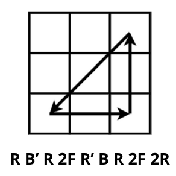
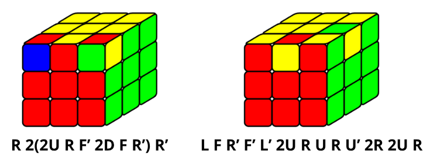

# Caracterizaciones y operaciones
El primer teorema que se explicará nos ayudará a determinar si una posición arbitraria puede ser transformada en la posición inicial con movimientos de cara.

**Teorema 6. "Primera regla de cubología".** Una posición $(\rho, \sigma, x, y)$ es posible si y solo si se cumplen estas tres condiciones:
- (a) $sgn$ $\rho = sgn$ $\sigma$.
- (b) $x_1 + x_2 + ... + x_8 = 0$ mod $3$.
- (c) $y_1 + y_2 + ... + y_{12} = 0$ mod $2$.

_Demostración._
- $(\Rightarrow)$ En primer lugar, tenemos que ver que para cada posición posible se cumplen las tres condiciones. Por un lado, la posición inicial $I_P$ cumple las condiciones: 
    - (a) $\rho = (1) \in S_8$ y $\sigma = (1) \in S_{12} \Rightarrow sgn$ $\rho = sgn$ $\sigma = 1$,
    - (b) $x_1 = ... = x_8 = 0 \Rightarrow x_1 + ... + x_8 = 0 = 0$ mod $3$,
    - (c) $y_1 = ... = y_{12} = 0 \Rightarrow y_1 + ... + y_{12} = 0 = 0$ mod $2$.
    Por otro lado, vemos que también se cumplen en cada giro de 90º de una cara desde una posición posible:
    - (a) Se cumple, ya que cada giro provoca un 4-ciclo tanto en las esquinas como en las aristas. Por esta razón, se produce el mismo cambio en el signo de $\rho$ que en el signo de $\sigma$. Entonces, si partimos de una posición posible, después del giro también se cumple que $sgn$ $\rho = sgn$ $\sigma$.
    - (b) Se cumple con los giros de la capa superior e inferior, ya que no provocan cambios en la orientación. También se cumple para los demás giros porque dos de los componentes aumentan una unidad modulo 3 y otros dos de los componentes disminuyen una unidad modulo 3, mientras que los demás se mantienen igual. Luego, $x_1 + 1 + x_2+1+x_3-1+x_4-1+x_5+x_6+x_7+x_8 = x_1+x_2+x_3+x_4+x_5+x_6+x_7+x_8 = 0$ mod $3$ porque partimos de una posición posible.
    - (c) Se cumple, ya que cada giro aumenta una unidad a cuatro de los componentes y como $4 = 0$ mod $2$, $y_1+...+y_{12}+4=y_1+...+y_{12}=0$ mod $2$ porque partimos de una posición posible.

Por lo tanto, al aplicar un movimiento a una posición posible, esa posición es también posible. Con esto queda demostrado que las tres condiciones son necesarias.

- $(\Leftarrow)$ Para demostrar que las tres condiciones son suficientes, hay que comprobar que a partir de cada posición $p=(\rho, \sigma, x, y)$ que cumple las tres condiciones es posible llegar a la posición inicial $I_P$, es decir, existe un algoritmo $m \in M$ tal que $m(p) = I_P$.

    - $(\alpha)$ Sin pérdida de generalidad, podemos asumir que $sgn$ $\rho = sgn$ $\sigma = 1$. Si fuera $sgn$ $\rho = sgn$ $\sigma = -1$, con un giro de una cara, cambiaría el signo de ambos a $1$.
    - $(\beta)$ Consideramos un algoritmo arbitrario que provoca un 3-ciclo en las esquinas. Por ejemplo, tomamos el algortimo de la figura (ver descripción de movimientos en [Tutorial](../docs/intro)), que provoca el 3-ciclo $(X_1, X_2, X_3)$ de las tres primeras esquinas sin cambiar el resto de esquinas, denotadas por $X_4, ..., X_8$. A este algoritmo lo llamaremos $m$. Para cada $i \in \{4, ..., 8\}$ existe un algoritmo $k_i$ de al menos un movimiento que transporta la esquina $X_i$ a la esquina $X_3$, sin interferir con las esquinas $X_1$ y $X_2$. Entones el algoritmo $k_imk'_i$ provoca exactamente el 3-ciclo $(X_1, X_2, X_i)$. Puesto que el conjunto formado por los seis 3-ciclos $(X_1, X_2, X_3), (X_1, X_2, X_4), ...,$ $(X_1, X_2, X_8)$ genera el grupo de permutaciones pares de $\{X_1, ..., X_8\}$ (ver Teorema 5), existe un algortimo $m_e \in M$ que transporta las 8 esquinas a sus lugares iniciales.

    
    
    - $(\gamma)$ Análogamente, considerando un algoritmo arbitrario que provoca un 3-ciclo en las aristas, se puede encontrar un algoritmo $m_a$ que transporta las 12 aristas a sus lugares iniciales.
    - $(\delta)$ En la posición $m_em_a(p)$ $(= m_am_e(p))$ todas las esquinas y aristas están colocadas correctamente. Además, por el apartado anterior se puede afirmar que esta posición es posible. Por último, quedan por orientar ciertas esquinas y aristas. Para orientarlas se pueden usar algoritmos explicados en la figura donde se orientan las aristas de dos en dos (se sigue cumpliendo la condición (c)) y las esquinas de dos en dos (sigue cumpliendo la condición (b) porque rotan hacia lados opuestos). Entonces, llamemos $m_{oe}$ y $m_{oa}$ a la sucesión de algoritmos que orientan todas las esquinas y aristas respectivamente.
    
    

    - $(\epsilon)$ La posición $m_em_am_{oe}m_{oa}(p) = I_P$, ya que todas las esquinas y aristas están colocadas correctamente y orientadas correctamente.

Con esto podemos ver que existe un algoritmo $m=m_em_am_{oe}m_{oa}$ tal que $m(p) = I_P$. $\Box$

Una consecuencia inmediata de la primera regla de cubología es
**Proposición 7.** El número de posibles posiciones es
    $$
        |P| = |G| = \frac{1}{12}|P^*| = \frac{1}{12} \cdot 8! \cdot 12! \cdot 3^8 \cdot 2^{12} =
        43.252.003.274.489.856.000 = 2^{27} \cdot 3^{14} \cdot 5^3 \cdot 7^2 \cdot 11.
    $$

_Demostración._ Para las ocho esquinas existen $8!$ posibles permutaciones y para las doce aristas existen $12!$ permutaciones. Como cada esquina puede ser orientada de tres formas distintas y cada arista puede ser orientada de dos formas distintas, tenemos
$$
    |P^*| = 8! \cdot 12! \cdot 3^8 \cdot 2^{12}
$$
Este número, para las posiciones posibles, se reduce a la mitad por la ecuación (a), ya que hay tantas permutaciones pares como impares; se reduce a un tercio por la ecuación (b), ya que dada la orientación de siete esquinas, podemos determinar la orientación de la octava; y se reduce a la mitad otra vez por la ecuación (c), ya que dada la orientación de once aristas, podemos determinar la orientación de la duodécima. $\Box$

**Teorema 7. "Segunda regla de cubología".** Una operación es posible si y solo si se cumplen estas tres condiciones:
- (a) El número total de ciclos de longitud par (de esquinas y aristas) es par.
- (b) El número total de esquinas giradas a la izquierda es igual al número de esquinas giradas a la derecha módulo 3.
- (c) El número de aristas reorientadas es par.

_Demostración._ El apartado (a) del Teorema 6 dice que la permutación causada en el conjunto de esquinas y aristas es par. Esto es equivalente a la condición (a) del Teorema 7, ya que un ciclo individual es una permutación par si y solo si su longitud es impar.
La condición (b) se cumple, ya que para que la suma del apartado (b) del Teorema 6 se cumpla, debe haber tantos $1$ (esquinas giradas a la izquierda) como $-1$ (esquinas giradas a la derecha) módulo $3$. Se puede realizar una explicación análoga a la anterior para la condición (c).$\Box$

Del teorema anterior, tenemos el siguiente corolario:

**Proposición 8.** A partir de una posición posible, si se intercambian dos esquinas (con cualquier orientación), dos aristas (con cualquier orientación), o se gira una única esquina o se gira una única arista, se obtiene una nueva posición que es imposible.
