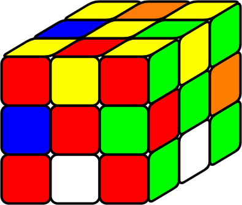

# Estructura del Grupo de Rubik y subgrupos
La biyección directa entre el grupo de Rubik $G$ y el conjunto $P$ de todas las posiciones posibles. Si $g = (\rho, \sigma, x, y) \in G$, entonces la esquina $i$ se encuentra en el cubículo $\rho(i)$ y la orientación de dicho cubito en el cubículo es $x_i = x(i)$ con $i \in \{1, \ldots, 8\}$ y la arista $j$ se encuentra en el cubículo $\sigma(j)$ con orientación $y(j)$ con $j \in \{1, \ldots, 12\}$. La operación posible de $g$ con otro elemento $g^*= (\rho^*, \sigma^*, x^*, y^*) \in G$ resulta en la posición $g^*g$, en la que la esquina $i$ se encuentra ahora en el cubículo $\rho^*\rho(i)$ y su orientación ahora es $x^*(i)+\rho^* x(i)$ mod $3$. De forma análoga, la arista $j$ se encuentra en la posición $\sigma^*\sigma(j)$ y su orientación es $y^*(j) + \sigma^*y(j)$ mod $2$. Con esto, la operación de dos elementos del grupo de Rubik se puede definir como:
$$
    g^*g = (\rho^*, \sigma^*, x^*, y^*)(\rho, \sigma, x, y) = (\rho^*\rho, \sigma^*\sigma, x^*+\rho^*x, y^*+\sigma^*y),
$$
donde la operación de los dos primeros elementos es el producto de permutaciones y la operación de los dos últimos elementos es la suma definida en los conjuntos $X=\{0,1,2\}^8$ y $Y=\{0,1\}^{12}$ módulo 3 y 2, respectivamente.

**Teorema 8.** Sean 
$$
    G_1 \coloneqq \{ g=(\rho, \sigma, x, y) \in G \mid x=\overline{0}, y=\overline{0}\},  
$$
$$
    G_2 \coloneqq \{ g=(\rho, \sigma, x, y) \in G \mid \rho=(1), \sigma=(1)\}.
$$
$G_1$ es el conjunto de todas las posibles operaciones que conservan la orientación de todas las esquinas y aristas y $G_2$ es el conjunto de todas las posibles operaciones que mantienen todas las esquinas y aristas en su cubículo inicial. Entonces, 
- (a) $G_1$ es subgrupo de $G$ y $G_2$ es subgrupo normal de $G$.
- (b) $G_1 \cong \{(\rho, \sigma) \in S_8 \times S_{12} \mid sgn $ $\rho = sgn$ $\sigma\}$ y $G_2 \cong C^7_3 \times C^{11}_2$.

_Demostración._ 
- (a) Es trivial que $G_1$ y $G_2$ sean subgrupos. Hay que estudiar la invariabilidad de $G_2$. Sea $g = (\rho, \sigma, x, y) \in G$, entonces $g' = (\rho', \sigma', -\rho x, -\sigma y)$ y para cada $g^*=(1, 1, x^*, y^*) \in G_2$ tenemos que $g'g^*g = (1, 1, x^*, y^*)$
- (b) $G_1 \cong \{(\rho, \sigma) \in S_8 \times S_{12} \mid sgn $ $\rho = sgn$ $\sigma\}$ es trivial. $G_2 \cong C^7_3 \times C^{11}_3$, ya que $G_2 \ni (1,1,(x_1, ..., x_8), (y_1, ..., y_{12})) \to ((x_1, ..., x_8),(y_1, ..., y_{12})) \in  C^7_3 \times C^{11}_2$ es un isomorfismo. $\Box$

El siguiente teorema muestra que el grupo de Rubik $G$ no es conmutativo:
**Teorema 9.** El centro del grupo de Rubik $Z(G)$ consiste en la posición inicial (elemento neutro de $G$) $I_G = (1, 1, \overline{0}, \overline{0})$ y el superflip $s = (1, 1, \overline{0}, \overline{1})$, es decir, el cubo con todas las aristas orientadas incorrectamente.

_Demostración._ Sea un elemento $g=(\rho, \sigma, x, y) \in Z(G)$. Entonces, se debe cumplir que $gg^* = g^*g$ para todo $g^*=(\rho^*, \sigma^*, x^*, y^*) \in Z(G)$, es decir, también se debe cumplir que $\rho\rho^* = \rho^*\rho$ y que $\sigma\sigma^* = \sigma^*\sigma$. Luego, por el Teorema 3 que dice que $Z(S_8)=\{(1)\}$ y $Z(S_{12})=\{(1)\}$ tenemos que $\rho = (1)$ y $\sigma=(1)$. Por otro lado, se debe cumplir también que $x^* + \rho^*x = x + x^* \Rightarrow \rho^*x = x$ y que $y^* + \sigma^*y = y + y^* \Rightarrow \sigma^*y = y$, estas igualdades implican que $x$ e $y$ son constantes. Sin embargo, el Teorema 6 excluye $x=\overline{1}$ y $x=\overline{2}$, ya que
$$
    1+1+1+1+1+1+1+1 = 8 \text{ mod } 3 = 2 \text{ mod } 3\neq 0 \text{ y }
$$
$$
    2+2+2+2+2+2+2+2 = 16 \text{ mod } 3 = 1 \text{ mod } 3 \neq 0.
$$
Por lo tanto, la única opción es $x=\overline{0}$. Pero no se excluye ni $y=\overline{0}$ ni $y=\overline{1}$, luego $g=(1, 1, \overline{0}, \overline{0})$ o $g=(1, 1, \overline{0}, \overline{1})$. $\Box$

A parte del centro de un grupo, la conmutatividad se puede medir con el subgrupo conmutador.
**Definición 15.** El **subgrupo conmutador** $K(A)$ del grupo $A$ está compuesto por todos los productos finitos de la forma $[a, b] \coloneqq aba'b'$. Estos elementos se llamarán **conmutadores**.

Para el caso del grupo de Rubik, tenemos este teorema:
**Teorema 10.** $K(G)=\{(\rho, \sigma, x, y) \in G \mid sgn$ $\rho = sgn$ $\sigma = 1 \}$

_Demostración._
- $(\subseteq)$ Sea $g = [g_1, g_2] = g_1g_2g'_1g'_2 = (\rho, \sigma, x, y) \in K(G)$ con $g_1=(\rho_1, \sigma_1, x_1, y_1) \in G$ y $g_2=(\rho_2, \sigma_2, x_2, y_2) \in G$. Luego, $\rho = \rho_1\rho_2\rho'_1\rho'_2$ y utilizando el Teorema 4 tenemos que $sgn$ $\rho = 1$ para todos $g_1, g_2 \in G$. De la misma manera, se cumple $sgn$ $\sigma = \sigma_1\sigma_2\sigma'_1\sigma'_2 = 1$ para todos $g_1, g_2 \in G$. Luego, para todo $g \in K(G)$ se cumple que $g\in \{(\rho, \sigma, x, y) \in G \mid sgn$ $\rho = sgn$ $\sigma = 1 \}$, lo que significa que $K(G) \subseteq \{(\rho, \sigma, x, y) \in G \mid sgn$ $\rho = sgn$ $\sigma = 1 \}$.

- $(\supseteq)$ Sea $g = (\rho, \sigma, x, y) \in G$ tal que $sgn$ $\rho = sgn$ $\sigma = 1$. Hay que probar que $g \in K(G)$. Para ello tomemos los algoritmos elementales de la demostración del Teorema 4 (intercambiar tres esquinas, intercambiar 3 aristas, reorientar hacia lados opuestos dos esquinas y reorientar dos aristas). Para estas algoritmos se pueden encontrar algoritmos que tienen la forma de un conmutador. Por ejemplo, el algortimo que reorienta dos aristas, se puede expresar como: 
        F U D' 2L 2U 2D R $\cdot$ U $\cdot$ R' 2D 2U 2L D U' F' $\cdot$ U'.

    Además, los algoritmos de la forma $m \cdot m_1m_2m'_1m'_2 \cdot m'$ son también conmutadores, ya que
    $$
        m \cdot m_1m_2m'_1m'_2 \cdot m' = (mm_1m')(mm_2m')(mm_1m')'(mm_2m')'.
    $$
    Tomando la imagen de estos algoritmos (conmutadores de $M$) a traves del homomorfismo $\pi$, tenemos conmutadores de $G$. Luego, $g \in K(G)$ para todo $g \in G$ tal que $sgn$ $\rho = sgn$ $\sigma = 1$. Luego, $K(G) \supseteq \{(\rho, \sigma, x, y) \in G \mid sgn$ $\rho = sgn$ $\sigma = 1 \}$.

En conclusión, $K(G) = \{(\rho, \sigma, x, y) \in G \mid sgn$ $\rho = sgn$ $\sigma = 1 \}$. $\Box$

Esta escasa conmutatividad promueve el estudio de subgrupos del grupo $G$. En concreto, son interesantes los grupos cíclicos. Se pueden encontrar dentro del cubo de Rubik subgrupos cíclicos. Un grupo $A$ se llama cíclico de orden $n$ cuando se puede generar a partir de un único elemento. Como todo grupo cíclico finito es isomorfo a $(C_n, \oplus)$ y todo grupo cíclico infinito es isomorfo a $(\mathbb{Z}, +)$, ya conocemos la estructura de los subgrupos de $G$. Luego, su orden es equivalente al número de elementos que contiene el subgrupo. Un ejemplo de un subgrupo cíclico de orden $n$ es el generado por un elemento $g$ tal que $g^n=I_P$ cuyo conjunto contiene los elementos $I_P, g, g^2, ..., g^{n-2}$ y $g^{n-1}$.

