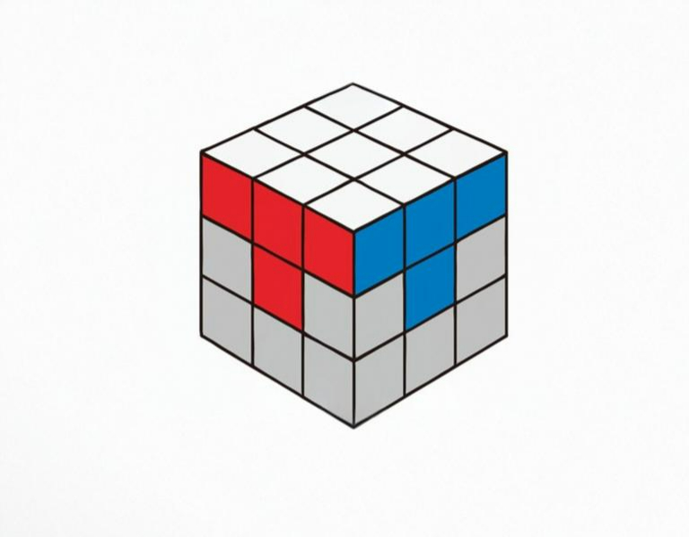

# Las esquinas de la capa superior

El siguiente paso es terminar de hacer la cara superior colocando las esquinas de dicha cara en su posición correcta. Para ello, si tomamos como cara frontal la cara roja, tenemos estos algoritmos principales: 

Para el resto de casos, se pueden aplicar algoritmos para llegar de esa posición a una de las dos posiciones anteriores. Estos algoritmos se detallan en la siguiente imagen.

Una vez colocadas todas las esquinas de la cara superior, daríamos por terminado este paso. Nos debería quedar algo como esto:

