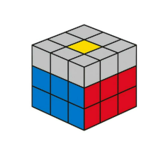

# Las aristas de la capa intermedia

Para los siguientes pasos, daremos la vuelta al cubo de modo que la cara superior sea ahora la inferior y viceversa.

En este paso, el objetivo es colocar las aristas de la capa intermedia del siguiente modo:

Para ello se aplicarán los algoritmos de la siguiente figura. Teniendo en cuenta que la cara frontal es aquella que contiene la arista que queremos colocar.

Se podría dar el caso en el que una de las aristas esté bien colocada, pero mal orientada. Esto se soluciona aplicando uno de los dos algoritmos anteriores dos veces.

