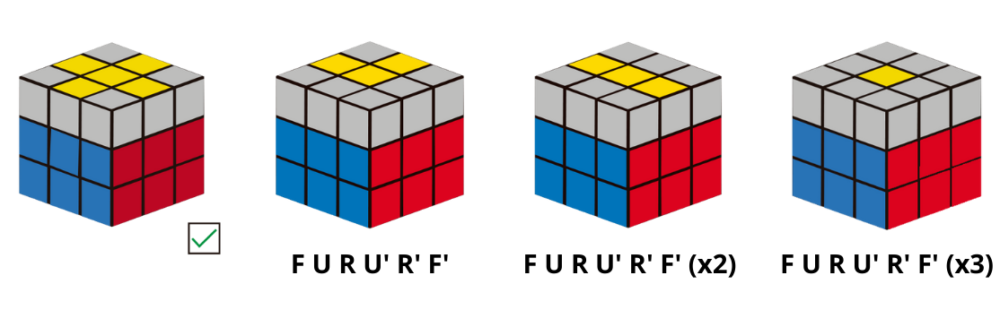

# La cruz de la última cara

Tras haber completado la capa intermedia, el siguiente paso es hacer una cruz en la última cara. Se pueden dar cuatro casos, que se solucionan con un único algoritmo:
- La cruz está completa, entonces continuaremos con el siguiente paso.
- Se ve una punta de flecha, entonces aplicaremos una vez el algoritmo colocando la punta de flecha en el fondo y en la izquierda.
- Se ve una línea, entonces aplicaremos el algoritmo dos veces colocando la línea en horizontal.
- Solo se ve el centro, entonces aplicaremos el algoritmo tres veces.

Esta imagen muestra los casos mencionados anteriormente junto con el algoritmo que hay que aplicar. Se toma la cara azul como cara frontal.
