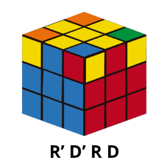

# Terminar el cubo

El último paso es orientar las esquinas colocadas. Para ello, elegiremos una esquina mal orientada y tomaremos como cara frontal aquella que deje a la esquina elegida en la parte superior derecha y aplicaremos el algoritmo hasta tener la esquina bien orientada.

El algoritmo es el siguiente:

Para orientar las demás debemos hacer U (ó U'), manteniendo la cara frontal elegida, hasta tener la siguiente esquina mal orientada en la parte superior derecha y repetimos el algoritmo hasta orientarla bien. Este proceso se repite hasta orientar todas las esquinas.